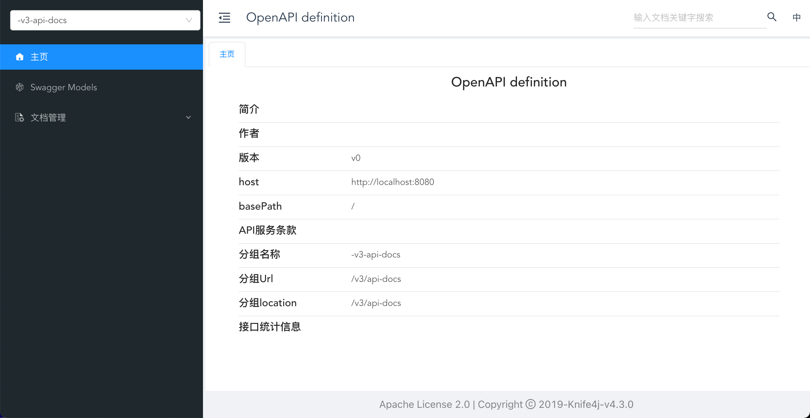

# 1.创建`Springboot`项目

## 添加依赖

```xml
<?xml version="1.0" encoding="UTF-8"?>
<project xmlns="http://maven.apache.org/POM/4.0.0" xmlns:xsi="http://www.w3.org/2001/XMLSchema-instance"
         xsi:schemaLocation="http://maven.apache.org/POM/4.0.0 https://maven.apache.org/xsd/maven-4.0.0.xsd">
    <modelVersion>4.0.0</modelVersion>
    <parent>
        <groupId>org.springframework.boot</groupId>
        <artifactId>spring-boot-starter-parent</artifactId>
        <version>3.2.6</version>
        <relativePath/>
    </parent>
    <groupId>org.example</groupId>
    <artifactId>langchain4j</artifactId>
    <version>0.0.1-SNAPSHOT</version>
    <name>langchain4j</name>
    <description>A Spring Boot project for LangChain integration</description>

    <properties>
        <maven.compiler.source>17</maven.compiler.source>
        <maven.compiler.target>17</maven.compiler.target>
        <project.build.sourceEncoding>UTF-8</project.build.sourceEncoding>
        <spring-boot.version>3.2.6</spring-boot.version>
        <knife4j.version>4.3.0</knife4j.version>
        <langchain4j.version>1.0.0-beta3</langchain4j.version>
        <mybatis-plus.version>3.5.11</mybatis-plus.version>
    </properties>

    <dependencies>
        <!-- Spring Boot 核心依赖 -->
        <dependency>
            <groupId>org.springframework.boot</groupId>
            <artifactId>spring-boot-starter</artifactId>
        </dependency>

        <!-- Web 应用程序依赖 -->
        <dependency>
            <groupId>org.springframework.boot</groupId>
            <artifactId>spring-boot-starter-web</artifactId>
        </dependency>

        <!-- 测试依赖 -->
        <dependency>
            <groupId>org.springframework.boot</groupId>
            <artifactId>spring-boot-starter-test</artifactId>
            <scope>test</scope>
        </dependency>

        <!-- Knife4j 依赖 -->
        <dependency>
            <groupId>com.github.xiaoymin</groupId>
            <artifactId>knife4j-openapi3-jakarta-spring-boot-starter</artifactId>
            <version>${knife4j.version}</version>
        </dependency>

        <dependency>
            <groupId>dev.langchain4j</groupId>
            <artifactId>langchain4j-open-ai</artifactId>
            <version>1.0.0-beta3</version>
        </dependency>
    </dependencies>

    <dependencyManagement>
        <dependencies>
            <dependency>
                <groupId>org.springframework.boot</groupId>
                <artifactId>spring-boot-dependencies</artifactId>
                <version>${spring-boot.version}</version>
                <type>pom</type>
                <scope>import</scope>
            </dependency>

            <!--引入langchain4j依赖管理清单-->
            <dependency>
                <groupId>dev.langchain4j</groupId>
                <artifactId>langchain4j-bom</artifactId>
                <version>${langchain4j.version}</version>
                <type>pom</type>
                <scope>import</scope>

            </dependency>
        </dependencies>
    </dependencyManagement>

    <build>
        <plugins>
            <plugin>
                <groupId>org.springframework.boot</groupId>
                <artifactId>spring-boot-maven-plugin</artifactId>
            </plugin>
        </plugins>
    </build>
</project>
```

`Knife4j` 是一个 **增强版的 `Swagger UI`**，用于在 `Java` 项目（尤其是 `Spring Boot`）中自动生成 **接口文档**。

启动之后访问 http://localhost:8080/doc.html 查看程序能否成功运行并显示如下页面



## 测试`Langchain4j`

写一个测试类

```java
@SpringBootTest
class Langchain4jApplicationTests {

    @Test
    void contextLoads() {

        //初始化模型 OpenAiChatModel
        OpenAiChatModel model = OpenAiChatModel.builder()
                //阿里云千问大模型
                .baseUrl("https://dashscope.aliyuncs.com/compatible-mode/v1")
                .apiKey("") //设置模型apiKey
                .modelName("qwen-plus") //设置模型名称
                .build();
        //向模型提问
        String answer = model.chat("你好");
        //输出结果
        System.out.println(answer);
    }

}
```

## Springboot集成

对于 OpenAI（`langchain4j-open-ai`），依赖项名称将是`langchain4j-open-ai-spring-boot-starter`：

```xml
<dependency>
    <groupId>dev.langchain4j</groupId>
    <artifactId>langchain4j-open-ai-spring-boot-starter</artifactId>
    <version>1.0.0-beta3</version>
</dependency>
```

然后，您可以在文件中配置模型参数，`application.properties`如下所示：

```ini
# 设置语言模型的API密钥和模型名称
langchain4j.open-ai.chat-model.base-url=https://dashscope.aliyuncs.com/compatible-mode/v1
langchain4j.open-ai.chat-model.api-key=你的key
langchain4j.open-ai.chat-model.model-name=qwen-plus
# 开启日志
langchain4j.open-ai.chat-model.log-requests=true
langchain4j.open-ai.chat-model.log-responses=true
#启用日志debug级别
logging.level.root=debug
```

在这种情况下，将自动创建一个实例`OpenAiChatModel`（一个实现），并且您可以在需要的地方注入该实例

```java
    @Autowired
    private OpenAiChatModel openAiChatModel;

    @Test
    public void testSpringBoot() {
        //向模型提问
        String answer = openAiChatModel.chat("你好");
        //输出结果
        System.out.println(answer);
    }
```

# 2.接入其他大模型

`LangChain4j`支持接入的大模型： https://docs.langchain4j.dev/integrations/language-models/

## 接入DeepSeek

访问官网： https://www.deepseek.com/ 注册账号，获取`base_url`和`api_key`，充值

然后`application.properties`配置

```ini
#DeepSeek 
langchain4j.open-ai.chat-model.base-url=https://api.deepseek.com 
langchain4j.open-ai.chat-model.api-key=${DEEP_SEEK_API_KEY} 
#DeepSeek-V3 
langchain4j.open-ai.chat-model.model-name=deepseek-chat 
#DeepSeek-R1 推理模型 
#langchain4j.open-ai.chat-model.model-name=deepseek-reasoner
```

## 接入阿里百炼平台

官网注册获取APIKEY

添加依赖

```xml
<dependency>
    <groupId>dev.langchain4j</groupId>
    <artifactId>langchain4j-community-dashscope-spring-boot-starter</artifactId>
</dependency>

<dependencyManagement>
    <dependency>
        <groupId>dev.langchain4j</groupId>
        <artifactId>langchain4j-community-bom</artifactId>
        <version>${langchain4j.version}<</version>
        <typ>pom</typ>
        <scope>import</scope>
    </dependency>
</dependencyManagement>
```

配置参数

```ini
#阿里百炼平台 
langchain4j.community.dashscope.chat-model.api-key=${DASH_SCOPE_API_KEY} langchain4j.community.dashscope.chat-model.model-name=qwen-plus
```

测试

```java
  @Autowired
  private QwenChatModel qwenChatModel;

  @Test
  public void testDashScopeQwen() {
      //向模型提问
      String answer = qwenChatModel.chat("你好");
      //输出结果
      System.out.println(answer);
  }
```

# 3.人工智能服务`AIService`

## 引入依赖

```xml
 <!--langchain4j高级功能-->
  <dependency>
      <groupId>dev.langchain4j</groupId>
      <artifactId>langchain4j-spring-boot-starter</artifactId>
  </dependency>
```

## 创建接口

使用`@AiService`注解，它可能用于标记一个接口，使其被框架（如 `langchain4j`）自动处理，生成 AI 服务的实现。  

- **动态代理**：框架会基于该接口生成代理类，处理方法调用（如 `chat(String message)`）。      
-  **依赖注入**：标记的接口会被 Spring 容器管理，允许通过 `@Autowired` 或其他方式注入。      
-  **AI 功能集成**：注解会将接口与 AI 模型（如 OpenAI 或其他语言模型）绑定，自动处理请求和响应。      

```java
@AiService
//如果你有很多AI模型实例，可用自定义绑定哪个模型
//@AiService(wiringMode = EXPLICIT, chatModel = "qwenChatModel")
public interface Assistant {
    String chat(String message);
}
```

## 测试

```
  @Autowired
  private Assistant assistant;

  @Test public void testAssistant() {
      String answer = assistant.chat("Hello");
      System.out.println(answer);
  }
```

## 工作原理

`AiServices`会组装`Assistant`接口以及其他组件，并使用**反射机制**创建一个实现`Assistant`接口的代理对象。 这个代理对象会**处理输入和输出**的所有转换工作。在这个例子中，`chat`方法的输入是一个字符串，但是大 模型需要一个 `UserMessage` 对象。所以，代理对象将这个字符串转换为 `UserMessage` ，并调用聊天语 言模型。`chat`方法的输出类型也是字符串，但是大模型返回的是 `AiMessage` 对象，代理对象会将其转换 为字符串。


