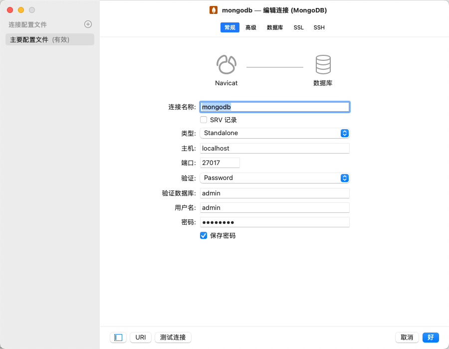
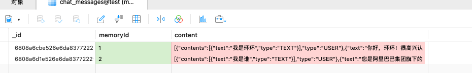
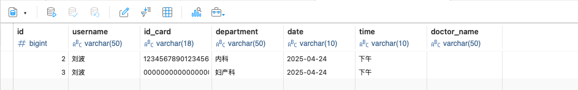
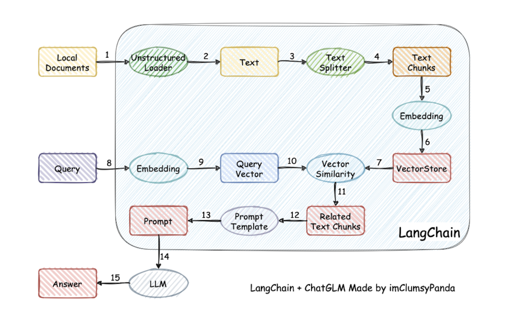
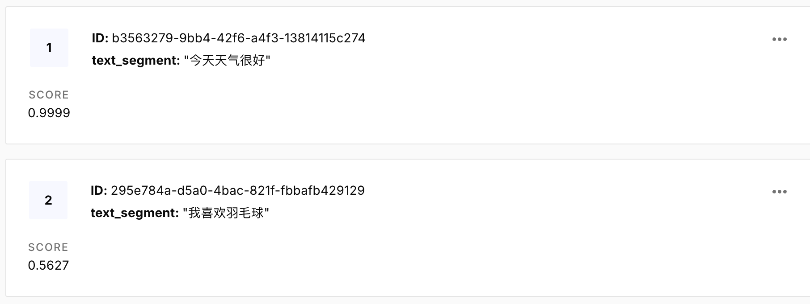
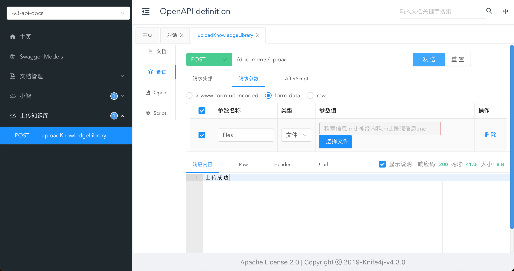
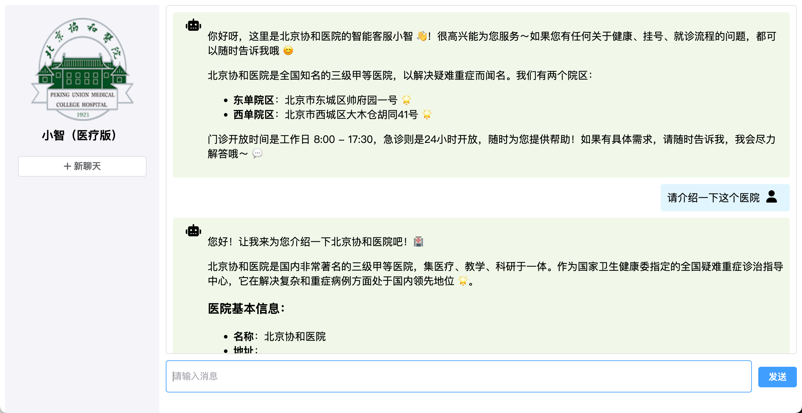

# 1.创建`Springboot`项目

## 添加依赖

```xml
<?xml version="1.0" encoding="UTF-8"?>
<project xmlns="http://maven.apache.org/POM/4.0.0" xmlns:xsi="http://www.w3.org/2001/XMLSchema-instance"
         xsi:schemaLocation="http://maven.apache.org/POM/4.0.0 https://maven.apache.org/xsd/maven-4.0.0.xsd">
    <modelVersion>4.0.0</modelVersion>
    <parent>
        <groupId>org.springframework.boot</groupId>
        <artifactId>spring-boot-starter-parent</artifactId>
        <version>3.2.6</version>
        <relativePath/>
    </parent>
    <groupId>org.example</groupId>
    <artifactId>langchain4j</artifactId>
    <version>0.0.1-SNAPSHOT</version>
    <name>langchain4j</name>
    <description>A Spring Boot project for LangChain integration</description>

    <properties>
        <maven.compiler.source>17</maven.compiler.source>
        <maven.compiler.target>17</maven.compiler.target>
        <project.build.sourceEncoding>UTF-8</project.build.sourceEncoding>
        <spring-boot.version>3.2.6</spring-boot.version>
        <knife4j.version>4.3.0</knife4j.version>
        <langchain4j.version>1.0.0-beta3</langchain4j.version>
        <mybatis-plus.version>3.5.11</mybatis-plus.version>
    </properties>

    <dependencies>
        <!-- Spring Boot 核心依赖 -->
        <dependency>
            <groupId>org.springframework.boot</groupId>
            <artifactId>spring-boot-starter</artifactId>
        </dependency>

        <!-- Web 应用程序依赖 -->
        <dependency>
            <groupId>org.springframework.boot</groupId>
            <artifactId>spring-boot-starter-web</artifactId>
        </dependency>

        <!-- 测试依赖 -->
        <dependency>
            <groupId>org.springframework.boot</groupId>
            <artifactId>spring-boot-starter-test</artifactId>
            <scope>test</scope>
        </dependency>

        <!-- Knife4j 依赖 -->
        <dependency>
            <groupId>com.github.xiaoymin</groupId>
            <artifactId>knife4j-openapi3-jakarta-spring-boot-starter</artifactId>
            <version>${knife4j.version}</version>
        </dependency>

        <dependency>
            <groupId>dev.langchain4j</groupId>
            <artifactId>langchain4j-open-ai</artifactId>
            <version>1.0.0-beta3</version>
        </dependency>
    </dependencies>

    <dependencyManagement>
        <dependencies>
            <dependency>
                <groupId>org.springframework.boot</groupId>
                <artifactId>spring-boot-dependencies</artifactId>
                <version>${spring-boot.version}</version>
                <type>pom</type>
                <scope>import</scope>
            </dependency>

            <!--引入langchain4j依赖管理清单-->
            <dependency>
                <groupId>dev.langchain4j</groupId>
                <artifactId>langchain4j-bom</artifactId>
                <version>${langchain4j.version}</version>
                <type>pom</type>
                <scope>import</scope>

            </dependency>
        </dependencies>
    </dependencyManagement>

    <build>
        <plugins>
            <plugin>
                <groupId>org.springframework.boot</groupId>
                <artifactId>spring-boot-maven-plugin</artifactId>
            </plugin>
        </plugins>
    </build>
</project>
```

`Knife4j` 是一个 **增强版的 `Swagger UI`**，用于在 `Java` 项目（尤其是 `Spring Boot`）中自动生成 **接口文档**。

启动之后访问 http://localhost:8080/doc.html 查看程序能否成功运行并显示如下页面


## 测试`Langchain4j`

写一个测试类

```java
@SpringBootTest
class Langchain4jApplicationTests {

    @Test
    void contextLoads() {

        //初始化模型 OpenAiChatModel
        OpenAiChatModel model = OpenAiChatModel.builder()
                //阿里云千问大模型
                .baseUrl("https://dashscope.aliyuncs.com/compatible-mode/v1")
                .apiKey("") //设置模型apiKey
                .modelName("qwen-plus") //设置模型名称
                .build();
        //向模型提问
        String answer = model.chat("你好");
        //输出结果
        System.out.println(answer);
    }

}
```

## Springboot集成

对于 OpenAI（`langchain4j-open-ai`），依赖项名称将是`langchain4j-open-ai-spring-boot-starter`：

```xml
<dependency>
    <groupId>dev.langchain4j</groupId>
    <artifactId>langchain4j-open-ai-spring-boot-starter</artifactId>
    <version>1.0.0-beta3</version>
</dependency>
```

然后，您可以在文件中配置模型参数，`application.properties`如下所示：

```ini
# 设置语言模型的API密钥和模型名称
langchain4j.open-ai.chat-model.base-url=https://dashscope.aliyuncs.com/compatible-mode/v1
langchain4j.open-ai.chat-model.api-key=你的key
langchain4j.open-ai.chat-model.model-name=qwen-plus
# 开启日志
langchain4j.open-ai.chat-model.log-requests=true
langchain4j.open-ai.chat-model.log-responses=true
#启用日志debug级别
logging.level.root=debug
```

在这种情况下，将自动创建一个实例`OpenAiChatModel`（一个实现），并且您可以在需要的地方注入该实例

```java
    @Autowired
    private OpenAiChatModel openAiChatModel;

    @Test
    public void testSpringBoot() {
        //向模型提问
        String answer = openAiChatModel.chat("你好");
        //输出结果
        System.out.println(answer);
    }
```

# 2.接入其他大模型

`LangChain4j`支持接入的大模型： https://docs.langchain4j.dev/integrations/language-models/

## 接入DeepSeek

访问官网： https://www.deepseek.com/ 注册账号，获取`base_url`和`api_key`，充值

然后`application.properties`配置

```ini
#DeepSeek 
langchain4j.open-ai.chat-model.base-url=https://api.deepseek.com 
langchain4j.open-ai.chat-model.api-key=${DEEP_SEEK_API_KEY} 
#DeepSeek-V3 
langchain4j.open-ai.chat-model.model-name=deepseek-chat 
#DeepSeek-R1 推理模型 
#langchain4j.open-ai.chat-model.model-name=deepseek-reasoner
```

## 接入阿里百炼平台

官网注册获取APIKEY

添加依赖

```xml
<dependency>
    <groupId>dev.langchain4j</groupId>
    <artifactId>langchain4j-community-dashscope-spring-boot-starter</artifactId>
</dependency>

<dependencyManagement>
    <dependency>
        <groupId>dev.langchain4j</groupId>
        <artifactId>langchain4j-community-bom</artifactId>
        <version>${langchain4j.version}<</version>
        <type>pom</type>
        <scope>import</scope>
    </dependency>
</dependencyManagement>
```

配置参数

```ini
#阿里百炼平台 
langchain4j.community.dashscope.chat-model.api-key=${DASH_SCOPE_API_KEY} langchain4j.community.dashscope.chat-model.model-name=qwen-plus
```

测试

```java
  @Autowired
  private QwenChatModel qwenChatModel;

  @Test
  public void testDashScopeQwen() {
      //向模型提问
      String answer = qwenChatModel.chat("你好");
      //输出结果
      System.out.println(answer);
  }
```

# 3.人工智能服务`AIService`

## 引入依赖

```xml
 <!--langchain4j高级功能-->
  <dependency>
      <groupId>dev.langchain4j</groupId>
      <artifactId>langchain4j-spring-boot-starter</artifactId>
  </dependency>
```

## 创建接口

`@AiService`定义如下

```java
@Service
@Target({ElementType.TYPE})
@Retention(RetentionPolicy.RUNTIME)
public @interface AiService {
    AiServiceWiringMode wiringMode() default AiServiceWiringMode.AUTOMATIC;
    String chatModel() default "";//绑定聊天模型
    String streamingChatModel() default "";
    String chatMemory() default "";//绑定聊天记忆
    String chatMemoryProvider() default "";//绑定聊天记忆隔离和持久化
    String contentRetriever() default "";//绑定内容检索器
    String retrievalAugmentor() default "";
    String moderationModel() default "";
    String[] tools() default {};//绑定工具
}
```

使用`@AiService`注解，它可能用于标记一个接口，使其被框架（如 `langchain4j`）自动处理，生成 AI 服务的实现。  

- **动态代理**：框架会基于该接口生成代理类，处理方法调用（如 `chat(String message)`）。      
-  **依赖注入**：标记的接口会被 Spring 容器管理，允许通过 `@Autowired` 或其他方式注入。      
-  **AI 功能集成**：注解会将接口与 AI 模型（如 OpenAI 或其他语言模型）绑定，自动处理请求和响应。      

```java
@AiService
//如果你有很多AI模型实例，可用自定义绑定哪个模型
//@AiService(wiringMode = EXPLICIT, chatModel = "qwenChatModel")
public interface Assistant {
    String chat(String message);
}
```

## 测试

```
  @Autowired
  private Assistant assistant;

  @Test public void testAssistant() {
      String answer = assistant.chat("Hello");
      System.out.println(answer);
  }
```

## 工作原理

`AiServices`会组装`Assistant`接口以及其他组件，并使用**反射机制**创建一个实现`Assistant`接口的代理对象。 这个代理对象会**处理输入和输出**的所有转换工作。在这个例子中，`chat`方法的输入是一个字符串，但是大 模型需要一个 `UserMessage` 对象。所以，代理对象将这个字符串转换为 `UserMessage` ，并调用聊天语 言模型。`chat`方法的输出类型也是字符串，但是大模型返回的是 `AiMessage` 对象，代理对象会将其转换 为字符串。

# 4.聊天记忆 `Chat memory`

## 使用`ChatMemory`实现聊天记忆

`ChatMemory`接口的定义如下：

```java
public interface ChatMemory {
    Object id();
		//添加消息
    void add(ChatMessage var1);
		//消息集合，存储历史消息
    List<ChatMessage> messages();
		//清空消息
    void clear();
}
```

`ChatMemory`有两个实现

- `MessageWindowChatMemory`：基于消息数量的滑动窗口，保留最近的 `N` 条消息。
- `TokenWindowChatMemory`：基于 `token` 数量的滑动窗口，保留最近的 `N` 个 `token`。

以下是`MessageWindowChatMemory`使用示例：

```java
@Test
public void testChatMemory3() {

    //创建chatMemory
    MessageWindowChatMemory chatMemory = MessageWindowChatMemory.withMaxMessages(10);
    //创建AIService
    Assistant assistant = AiServices
            .builder(Assistant.class)
            .chatLanguageModel(openAiChatModel)
            .chatMemory(chatMemory)
            .build();
    //调用service的接口
    String answer1 = assistant.chat("我是环环");
    System.out.println(answer1);
    String answer2 = assistant.chat("我是谁");
    System.out.println(answer2);
}
```

## 结合`AIService`实现聊天记忆

### 创建记忆对话智能体

当`AIService`由多个组件（大模型，聊天记忆等）组成的时候，我们就可以称他为 **智能体** 了

```java
@AiService(
        wiringMode = AiServiceWiringMode.EXPLICIT,
        chatModel = "openAiChatModel",
        chatMemory = "chatMemory"
)
public interface MemoryChatAssistant {
    String chat(String message);
}
```

### 配置ChatMemory

```java
@Configuration
public class MemoryChatAssistantConfig {

    @Bean
    public ChatMemory chatMemory() {
        return MessageWindowChatMemory.withMaxMessages(10);
    }
}
```

### 测试

```java
@Autowired
private MemoryChatAssistant memoryChatAssistant;

@Test
public void testChatMemory4() {
    String answer1 = memoryChatAssistant.chat("我是环环");
    System.out.println(answer1);
    String answer2 = memoryChatAssistant.chat("我是谁");
    System.out.println(answer2);
}
```

## 隔离聊天记忆

隔离不同的聊天，比如我想开启一个新的聊天

### 创建记忆隔离对话智能体

```java
@AiService(
        wiringMode = AiServiceWiringMode.EXPLICIT,
        chatModel = "openAiChatModel",//找到对应的bean进行绑定
        //chatMemory = "chatMemory",//找到对应的bean进行绑定
        chatMemoryProvider = "chatMemoryProvider"//找到对应的bean进行绑定
)
public interface SeparateChatAssistant {
    String chat(@MemoryId int memoryId, @UserMessage String userMessage);
}
```

**不能同时使用 `chatMemory` (单一会话内存）和 `chatMemoryProvider`（多会话内存）**

为每个用户或会话提供独立的 `ChatMemory` 实例，根据提供的 `memoryId`（通常是用户 ID 或会话 ID）返回对应的 `ChatMemory` 实例。

- `@MemoryId` 注解用于标识方法参数，该参数的值将作为 `memoryId` 传递给 `chatMemoryProvider`，以获取对应的 `ChatMemory` 实例。
- `@UserMessage` 注解用于标识方法参数，该参数的值将作为用户消息发送给大语言模型（LLM）。

### 配置`ChatMemoryProvider`

```java
@Configuration
public class SeparateChatAssistantConfig {
    @Bean
    public ChatMemoryProvider chatMemoryProvider() {
        return memoryId -> MessageWindowChatMemory.builder()
                .id(memoryId)
                .maxMessages(10)
                .build();
      //看不懂这种写法的，可以看下面这种
        return new ChatMemoryProvider() {
                  @Override
                  public ChatMemory get(Object memoryId) {
                      return MessageWindowChatMemory.builder()
                          .id(memoryId)
                          .maxMessages(10)
                          .build();
                  }
              }
      
    }
}
```

`ChatMemoryProvider`：这是一个函数式接口，定义了如何根据 `memoryId`（通常是用户 ID 或会话 ID）提供对应的 `ChatMemory` 实例。定义如下：

```java
@FunctionalInterface
public interface ChatMemoryProvider {
    ChatMemory get(Object var1);
}
```

每当有新的对话请求时，LangChain4j 会调用 `chatMemoryProvider` 的 `get` 方法，传入当前的 `memoryId`，以获取对应的 `ChatMemory` 实例。

这意味着，对于每个不同的 `memoryId`，都会有一个独立的对话记忆实例，确保多用户或多会话场景下的对话上下文不会混淆。

### 测试

```java
@Autowired
private SeparateChatAssistant separateChatAssistant;

@Test
public void testChatMemory5() {

    String answer1 = separateChatAssistant.chat(1, "我是环环");
    System.out.println(answer1);
    String answer2 = separateChatAssistant.chat(1, "我是谁");
    System.out.println(answer2);
    String answer3 = separateChatAssistant.chat(2, "我是谁");
    System.out.println(answer3);

}
```

# 5.持久化聊天记忆 `Persistence`

默认情况下，聊天记忆**存储在内存**中。如果需要持久化存储，可以将其存储在数据库中，然后数据库的选型就需要根据具体的业务场景。

## 数据库的选择

`MySQL`

- 特点：关系型数据库。支持事务处理，确保数据的一致性和完整性，**适用于结构化数据的存储和查询**。

- 适用场景：如果**聊天记忆数据结构较为规整**，例如包含固定的字段如对话 ID、用户 ID、时间 戳、消息内容等，且**需要进行复杂的查询和统计分析**，如按用户统计对话次数、按时间范围查询特定对话等，`MySQL` 是不错的选择。

`Redis`

- 特点：**内存数据库，读写速度极高**。它适用于存储热点数据，并且支持多种数据结构，如字符 串、哈希表、列表等，方便对不同类型的聊天记忆数据进行处理。

- 适用场景：**对于实时性要求极高的聊天应用，如在线客服系统或即时通讯工具**，`Redis` 可以快 速存储和获取最新的聊天记录，以提供流畅的聊天体验。


`MongoDB`

- 特点：文档型数据库，数据以`BSON`的文档形式存储，具有高度的灵活性和可扩展性。**它不需要预先定义严格的表结构，适合存储半结构化或非结构化的数据。**

- 适用场景：当聊天记忆中包含多样化的信息，如文本消息、图片、语音等多媒体数据，或者**消息格式可能会频繁变化时，`MongoDB` 能很好地适应这种灵活性**。例如，一些社交应用中用户可能会发送各种格式的消息，使用 `MongoDB` 可以方便地存储和管理这些不同类型的数据。


## `MongoDB`

安装

使用`docker`进行安装，简单方便

```ini
docker pull mongodb

docker run -d \
  --name mongodb \
  -p 27017:27017 \
  -e MONGO_INITDB_ROOT_USERNAME=admin \
  -e MONGO_INITDB_ROOT_PASSWORD=123456 \
  mongo:latest
```

使用`Navicat`连接MongoDB

## 整合`Springboot`

### 添加依赖

```xml
 <!-- Spring Boot Starter Data MongoDB -->
<dependency>
    <groupId>org.springframework.boot</groupId>
    <artifactId>spring-boot-starter-data-mongodb</artifactId>
</dependency>
```

### 配置文件中添加如下配置

```ini
# 设置mongodb数据库的配置
spring.data.mongodb.host=localhost
spring.data.mongodb.port=27017
spring.data.mongodb.username=admin
spring.data.mongodb.password=123456
spring.data.mongodb.authentication-database=admin
```

### 测试

创建实体类：映射`MongoDB`中的文档（相当与MySQL的表）

```java
@Data
@Document("chat_messages")
public class ChatMessages {

    //唯一标识，映射到 MongoDB 文档的 _id 字段
    @Id
    private ObjectId messageId;

    private String content; //存储当前聊天记录列表的json字符串
}
```

创建测试类

```java
@SpringBootTest
public class MongoCrudTest {

    @Autowired
    private MongoTemplate mongoTemplate;

    @Test
    public void testCreateChatMessage() {
        ChatMessages chatMessage = new ChatMessages();
        chatMessage.setMessageId(new ObjectId());
        chatMessage.setContent("{\"message\":\"Hello, world!\"}");

        ChatMessages savedMessage = mongoTemplate.save(chatMessage);
        assertNotNull(savedMessage.getMessageId());
        System.out.println("Created ChatMessage: " + savedMessage);
    }

    @Test
    public void testReadChatMessage() {
        ObjectId id = new ObjectId(); // Replace with an existing ID in your database
        ChatMessages chatMessage = mongoTemplate.findById(id, ChatMessages.class);
        assertNotNull(chatMessage);
        System.out.println("Read ChatMessage: " + chatMessage);
    }

    @Test
    public void testUpdateChatMessage() {
        ObjectId id = new ObjectId(); // Replace with an existing ID in your database
        ChatMessages chatMessage = mongoTemplate.findById(id, ChatMessages.class);
        assertNotNull(chatMessage);

        chatMessage.setContent("{\"message\":\"Updated content\"}");
        ChatMessages updatedMessage = mongoTemplate.save(chatMessage);
        assertEquals("{\"message\":\"Updated content\"}", updatedMessage.getContent());
        System.out.println("Updated ChatMessage: " + updatedMessage);
    }

    @Test
    public void testDeleteChatMessage() {
        ObjectId id = new ObjectId(); // Replace with an existing ID in your database
        ChatMessages chatMessage = mongoTemplate.findById(id, ChatMessages.class);
        assertNotNull(chatMessage);

        mongoTemplate.remove(chatMessage);
        ChatMessages deletedMessage = mongoTemplate.findById(id, ChatMessages.class);
        assertNull(deletedMessage);
        System.out.println("Deleted ChatMessage with ID: " + id);
    }
}
```

`new ObjectId()` 会返回一个 **新的 MongoDB `ObjectId`** 实例。`ObjectId` 是 `MongoDB` 默认使用的主键类型，它是一个 **12 字节**的 `BSON` 类型，通常用作 `_id` 字段。`ObjectId` 的值是一个有效的 `24 字符`的十六进制字符串。`12*8=24*4=96`

`ObjectId` 的值由以下部分组成：

1. **4 字节**：当前时间戳（秒级，表示创建的时间）
2. **5 字节**：机器标识符和进程ID（唯一）
3. **3 字节**：计数器（递增值，用于确保在同一毫秒内创建多个 `ObjectId` 时的唯一性）

`new ObjectId()`默认使用当前时间戳，当然你也可以传入一个时间戳

## 持久化聊天

### 优化消息实体类

```java
@Data
@Document("chat_messages")
public class ChatMessages {

    //唯一标识，映射到 MongoDB 文档的 _id 字段
    @Id
    private ObjectId id;

    private int messageId;

    private String content; //存储当前聊天记录列表的json字符串
}
```

### 创建持久化类

创建一个类实现`ChatMemoryStore`接口,`ChatMemoryStore`定义如下

```java
public interface ChatMemoryStore {
    List<ChatMessage> getMessages(Object var1);

    void updateMessages(Object var1, List<ChatMessage> var2);

    void deleteMessages(Object var1);
}
```

`ChatMemoryStore` 接口定义了以下三个方法：

1. `List<ChatMessage> getMessages(Object memoryId)`
   - 根据 `memoryId`（通常是用户 ID 或会话 ID）检索对应的聊天消息列表。
2. `void updateMessages(Object memoryId, List<ChatMessage> messages)`
   - 更新指定 `memoryId` 的聊天消息列表。每当有新的消息添加到聊天内存中时，`LangChain4j` 会调用此方法
3. `void deleteMessages(Object memoryId)`
   - 删除指定 `memoryId` 的所有聊天消息。

这些方法允许你**实现自定义的持久化逻辑**，以满足特定的存储需求。

具体的实现类为：

```java
@Component
public class MongoChatMemoryStore implements ChatMemoryStore {

    @Autowired
    private MongoTemplate mongoTemplate;

    @Override
    public List<ChatMessage> getMessages(Object objectId) {
        Criteria criteria = Criteria.where("id").is(objectId);
        Query query = new Query(criteria);
        ChatMessages chatMessages = mongoTemplate.findOne(query, ChatMessages.class);
        if (chatMessages == null) {
            return new LinkedList<>();
        }
        return ChatMessageDeserializer.messagesFromJson(chatMessages.getContent());
    }

    @Override
    public void updateMessages(Object objectId, List<ChatMessage> messages) {

        Criteria criteria = Criteria.where("id").is(objectId);
        Query query=new Query(criteria);
        Update update=new Update();
        update.set("content", ChatMessageSerializer.messagesToJson(messages));

        // 使用 upsert 方法，如果不存在则插入新文档
        mongoTemplate.upsert(query, update, ChatMessages.class);

    }

    @Override
    public void deleteMessages(Object objectId) {
        
        Criteria criteria = Criteria.where("id").is(objectId);
        Query query=new Query(criteria);
        mongoTemplate.remove(query, ChatMessages.class);

    }
}
```

| 类                        | 作用                                                         |
| ------------------------- | ------------------------------------------------------------ |
| `Criteria`                | 构建查询条件（`where`）                                      |
| `Query`                   | 封装查询请求（条件 + 分页 + 排序等）                         |
| `ChatMessageSerializer`   | 是 `LangChain4j` 中的一个工具类，用于将聊天消息对象序列化为 `JSON` 字符串。 |
| `ChatMessageDeserializer` | 是 `LangChain4j` 中的一个工具类，用于将 `JSON` 字符串反序列化为聊天消息对象。 |

### 更改配置类

**在`SeparateChatAssistantConfig`中，添加`MongoChatMemoryStore`对象的配置**

```java
@Configuration
public class SeparateChatAssistantConfig {

    @Autowired
    private MongoChatMemoryStore mongoChatMemoryStore;

    @Bean
    public ChatMemoryProvider chatMemoryProvider() {
        return memoryId -> MessageWindowChatMemory.builder()
                .id(memoryId)
                .maxMessages(10)
                .chatMemoryStore(mongoChatMemoryStore)//配置持久化存储
                .build();
    }

}
```

### 测试

```java
  @Autowired
  private SeparateChatAssistant separateChatAssistant;

  @Test
  public void testChatMemory5() {

      String answer1 = separateChatAssistant.chat(1, "我是环环");
      System.out.println(answer1);
      String answer2 = separateChatAssistant.chat(1, "我是谁");
      System.out.println(answer2);
      String answer3 = separateChatAssistant.chat(2, "我是谁");
      System.out.println(answer3);

  }
```



# 6.提示词 Prompt

## 系统提示词

`@SystemMessage` 设定角色，塑造AI助手的专业身份，明确助手的能力范围

配置`@SystemMessage`

在`SeparateChatAssistant`类的`chat`方法上添加`@SystemMessage`注解

```java
@AiService(
        wiringMode = AiServiceWiringMode.EXPLICIT,
        chatModel = "openAiChatModel",//找到对应的bean进行绑定
        chatMemory = "chatMemory",//找到对应的bean进行绑定
        chatMemoryProvider = "chatMemoryProvider"//找到对应的bean进行绑定
)
public interface SeparateChatAssistant {
    @SystemMessage("你是一个智能助手，请用湖南话回答问题。")
    String chat(@MemoryId int memoryId, @UserMessage String userMessage);
}
```

`@SystemMessage` 的内容将在后台转换为 `SystemMessage` 对象，并与 `UserMessage` 一起发送给大语

言模型（`LLM`）

## 测试

```java
@SpringBootTest
public class PromptTest {
    @Autowired
    private SeparateChatAssistant separateChatAssistant;

    @Test
    public void testSystemMessage() {

        String answer = separateChatAssistant.chat(3, "今天几号");

        System.out.println(answer);

    }

}
```

请求体的内容如下：

```
[{
  "model" : "qwen-plus",
  "messages" : [ {
    "role" : "system",
    "content" : "你是一个智能助手，请用湖南话回答问题。"
  }, {
    "role" : "user",
    "content" : "今天几号"
  } ],
  "stream" : false
}]
```

## 从资源文件中加载提示模板

`@SystemMessage` 注解还可以从资源文件中加载提示模板

创建`resources/prompts/assistant.txt`

```ini
你是一个智能助手，请用湖南话回答问题。
Current time: {{time}}
```

`{{time}}` 你要传入的变量。

修改`SeparateChatAssistant`类

```java
@AiService(
        wiringMode = AiServiceWiringMode.EXPLICIT,
        chatModel = "openAiChatModel",//找到对应的bean进行绑定
        chatMemory = "chatMemory",//找到对应的bean进行绑定
        chatMemoryProvider = "chatMemoryProvider"//找到对应的bean进行绑定
)
public interface SeparateChatAssistant {
//    @SystemMessage("你是一个智能助手，请用湖南话回答问题。")
    @SystemMessage(fromResource = "prompts/assistant.txt")
    String chat(@MemoryId int memoryId, @UserMessage String userMessage, @V("time")String time);
}
```

`@SystemMessage(fromResource = "...")` 表示从资源文件中加载提示。

`@V("time")` 自动填入提示模板中的对应占位符。

请求体为：

```
[{
  "model" : "qwen-plus",
  "messages" : [ {
    "role" : "system",
    "content" : "你是一个智能助手，请用湖南话回答问题。\nCurrent time: 2025-04-24T09:46:14.332756\n"
  }, {
    "role" : "user",
    "content" : "今天几号"
  } ],
  "stream" : false
}]
```

## 用户提示词

`@UserMessage`：获取用户输入

```java
@AiService(
        wiringMode = AiServiceWiringMode.EXPLICIT,
        chatModel = "openAiChatModel",//找到对应的bean进行绑定
        chatMemory = "chatMemory"//找到对应的bean进行绑定
)
public interface MemoryChatAssistant {
    @UserMessage(fromResource = "prompts/assistant.txt")
    String chat(String time);
}
```

当只有一个参数时，不需要使用`@V`注解，但是需要同名，可以自动绑定

测试

```java
@Autowired
private MemoryChatAssistant memoryChatAssistant;

@Test
public void testUserMessage() {

    String answer = memoryChatAssistant.chat(LocalDateTime.now().toString());
    System.out.println(answer);
}
```

请求体：

```
[{
  "model" : "qwen-plus",
  "messages" : [ {
    "role" : "user",
    "content" : "你是一个智能助手，请用湖南话回答问题。\nCurrent time: 2025-04-24T10:01:40.622852\n"
  } ],
  "stream" : false
}]
```

# 7.项目实战-创建小智

这部分实现硅谷小智的基本聊天功能，包含聊天记忆、聊天记忆持久化、提示词

## 创建硅谷小智

创建`xiaozhi-prompt-template.txt`

```
你的名字是“小智”，你是一家名为“北京协和医院”的智能客服。 你是一个训练有素的医疗顾问和医疗伴诊助手。 你态度友好、礼貌且言辞简洁。
1、请仅在用户发起第一次会话时，和用户打个招呼，并介绍你是谁。
2、作为一个训练有素的医疗顾问： 请基于当前临床实践和研究，针对患者提出的特定健康问题，提供详细、准确且实用的医疗建议。请同时考虑可能的病 因、诊断流程、治疗方案以及预防措施，并给出在不同情境下的应对策略。对于药物治疗，请特别指明适用的药品名 称、剂量和疗程。如果需要进一步的检查或就医，也请明确指示。
3、作为医疗伴诊助手，你可以回答用户就医流程中的相关问题，主要包含以下功能： AI分导诊：根据患者的病情和就医需求，智能推荐最合适的科室。 AI挂号助手：实现智能查询是否有挂号号源服务；实现智能预约挂号服务；实现智能取消挂号服务。
4、你必须遵守的规则如下： 在获取挂号预约详情或取消挂号预约之前，你必须确保自己知晓用户的姓名（必选）、身份证号（必选）、预约科室 （必选）、预约日期（必选，格式举例：2025-04-14）、预约时间（必选，格式：上午 或 下午）、预约医生（可 选）。 当被问到其他领域的咨询时，要表示歉意并说明你无法在这方面提供帮助。
5、请在回答的结果中适当包含一些轻松可爱的图标和表情。
6、今天是 {{current_date}}。
```

**配置持久化和记忆隔离,**创建一个`chatMemoryProviderXiaozhi`,使用`mongoChatMemoryStore`进行消息持久化

```java
@Configuration
public class XiaozhiAgentConfig {

    @Autowired
    private MongoChatMemoryStore mongoChatMemoryStore;

    public ChatMemoryProvider chatMemoryProviderXiaozhi() {
        return memoryId -> MessageWindowChatMemory.builder()
                .id(memoryId)
                .maxMessages(20)
                .chatMemoryStore(mongoChatMemoryStore)
                .build();
    }
}
```

创建`XiaozhiAgent`

```java
@AiService(
        wiringMode = AiServiceWiringMode.EXPLICIT,
        chatModel = "openAiChatModel",//找到对应的bean进行绑定
        chatMemoryProvider = "chatMemoryProviderXiaozhi"//找到对应的bean进行绑定
)
public interface XiaozhiAgent {

    @SystemMessage(fromResource = "prompts/xiaozhi-prompt-template.txt")
    String chat(@MemoryId int memoryId, @UserMessage String userMessage);
}
```

创建聊天数据传输对象`ChatFormDTO`

```java
@Data
public class ChatFormDTO {
    //会话id
    private int memoryId;
    //用户消息
    private String userMessage;
}
```

最后创建`XiaozhiController`

```java
@Tag(name = "小智")
@RestController
@RequestMapping("/xiaozhi")
public class XiaozhiController {

    @Autowired
    private XiaozhiAgent xiaozhiAgent;

    @Operation(summary = "对话")
    @PostMapping("/chat")
    public String chat(@RequestBody ChatFormDTO chatFormDTO) {
        return xiaozhiAgent.chat(chatFormDTO.getMemoryId(), chatFormDTO.getUserMessage());
    }
}
```

## 启动时遇到的问题

我创建了两个`ChatMemoryProvider`类型的`Bean`：`chatMemoryProvider`和`chatMemoryProviderXiaozhi`

所以在@`AiService`中需要指定`chatMemoryProvider`用哪个`ChatMemoryProvider`

```
@AiService(
        wiringMode = AiServiceWiringMode.EXPLICIT,
        chatModel = "openAiChatModel",//找到对应的bean进行绑定
        chatMemoryProvider = "chatMemoryProviderXiaozhi"//找到对应的bean进行绑定
)
```

但是我有一个`Assistant`什么都没指定

```
@AiService()
public interface Assistant {
    String chat(String message);
}
```

当你使用 `@AiService()` 而不指定任何参数时，框架会尝试自动注入所需的组件，如 `ChatModel`、`ChatMemory` 或 `ChatMemoryProvider`。

所以当上下文中存在多个相同类型的 Bean（例如多个 `ChatMemoryProvider`），框架将无法确定使用哪个 Bean，从而抛出 `IllegalConfigurationException` 异常。

这个时候把`Assistant`删掉就行，这个只是之前测试用的

# 8.`Function Calling` 函数调用

`Function Calling` 函数调用 也叫`Tools` 工具

## 入门案例

大语言模型本身并不擅长数学运算。如果应用场景中偶尔会涉及到数学计算，我们可以为他提供 一个 “数学工具”。当我们提出问题时，**大语言模型会判断是否使用某个工具**。

### 创建工具类

通过在方法上添加 `@Tool` 注解，并在构建 AI 服务时显式指定这些工具，LLM 可以根据用户的请求决定是否调用相应的工具方法。

```java
@Retention(RetentionPolicy.RUNTIME)
@Target({ElementType.METHOD})
public @interface Tool {
    String name() default "";

    String[] value() default {""};
}
```

- `name`（可选）：指定工具的**名称**。如果未提供，默认使用方法名。
- `value`（可选）：提供工具的**描述**，有助于 LLM 更好地理解工具的用途。

此外，可以使用 `@P` 注解为**方法参数添加描述**，增强 LLM 对参数含义的理解。

-  `value`：参数的描述信息，这是必填字段。
- `required`：表示该参数是否为必需项，默认值为 true ，此为可选字段。

`@ToolMemoryId`注解用于在**工具方法的参数上**指定用于关联对话上下文的内存标识符（`memoryID`）,提供给`AIService`方法的`memoryID`将自动传递给 `@Tool` 方法

调用流程如下：

1. `LLM` 接收用户输入。
2. 判断是否需要调用工具方法。(第一次调用大模型)
3. 如果需要，调用相应的 `@Tool` 方法，并获取返回结果。（第二次调用大模型）
4. 将工具方法的返回结果作为对话的一部分，继续与用户交互。

```java
@Component
public class CalculatorTools {

    @Tool(name = "加法", value = "返回两个参数相加之和")
    double sum(@ToolMemoryId int memoryId, @P(value = "加数1", required = true) double a,@P(value = "加数2", required = true) double b) {
        System.out.println("调用加法运算 " + memoryId);
        return a + b;

    }

    @Tool(name = "平方根", value = "返回给定参数的平方根")
    double squareRoot(@ToolMemoryId int memoryId, double x) {

        System.out.println("调用平方根运算 " + memoryId);
        return Math.sqrt(x);

    }

}
```

### 为`Agent`配置工具类

修改`SeparateChatAssistant`类

```java
@AiService(
        wiringMode = AiServiceWiringMode.EXPLICIT,
        chatModel = "openAiChatModel",//找到对应的bean进行绑定
//        chatMemory = "chatMemory",//找到对应的bean进行绑定
        chatMemoryProvider = "chatMemoryProvider",//找到对应的bean进行绑定
        tools = "calculatorTools"//找到对应的bean进行绑定
)
public interface SeparateChatAssistant {
//    @SystemMessage("你是一个智能助手，请用湖南话回答问题。")
    @SystemMessage(fromResource = "prompts/assistant.txt")
    String chat(@MemoryId int memoryId, @UserMessage String userMessage, @V("time")String time);
}
```

### 测试

```java
@Autowired
private SeparateChatAssistant separateChatAssistant;

@Test
public void testCalculatorTools() {

    String answer = separateChatAssistant.chat(4, "1+2等于几，475695037565的平方根是多少？",
            LocalDateTime.now().toString());

    System.out.println(answer);

}
```

可以在控制台看一下调用的流程

# 9.项目实战-优化小智

## 预约业务的实现

这部分我们实现硅谷小智的**查询订单、预约订单、取消订单**的功能

### 安装`MySQL`

使用docker进行安装

```ini
docker pull mysql:8.0

docker run -d \
  --name my-mysql \
  -e MYSQL_ROOT_PASSWORD=123456 \
  -e TZ=Asia/Shanghai \
  -p 3306:3306 \
  -v ~/mysql-data:/var/lib/mysql \
  mysql:8.0 \
  --character-set-server=utf8mb4 \
  --collation-server=utf8mb4_general_ci
```

然后使用`Navicat`连接`MySQL`

### 创建数据库表

```sql
-- 创建数据库
CREATE DATABASE IF NOT EXISTS `xiaozhi` CHARACTER SET utf8mb4 COLLATE utf8mb4_general_ci;

-- 使用数据库
USE `xiaozhi`;

-- 创建预约表
CREATE TABLE `appointment` (
  `id` BIGINT NOT NULL AUTO_INCREMENT COMMENT '主键ID',
  `username` VARCHAR(50) NOT NULL COMMENT '预约人姓名',
  `id_card` VARCHAR(18) NOT NULL COMMENT '身份证号',
  `department` VARCHAR(50) NOT NULL COMMENT '预约科室',
  `date` VARCHAR(10) NOT NULL COMMENT '预约日期（格式：yyyy-MM-dd）',
  `time` VARCHAR(10) NOT NULL COMMENT '预约时间（格式：HH:mm）',
  `doctor_name` VARCHAR(50) DEFAULT NULL COMMENT '医生姓名',
  PRIMARY KEY (`id`)
) COMMENT='预约信息表';
```

### 引入依赖

```xml
<!-- Mysql Connector -->
<dependency>
    <groupId>com.mysql</groupId>
    <artifactId>mysql-connector-j</artifactId>
</dependency>
<!--mybatis-plus 持久层-->
<dependency>
    <groupId>com.baomidou</groupId>
    <artifactId>mybatis-plus-spring-boot3-starter</artifactId>
    <version>${mybatis-plus.version}</version>
</dependency>
<!--代码生成器-->
<dependency>
    <groupId>com.baomidou</groupId>
    <artifactId>mybatis-plus-generator</artifactId>
    <version>3.5.9</version>
</dependency>
<dependency>
    <groupId>org.freemarker</groupId>
    <artifactId>freemarker</artifactId>
    <version>2.3.31</version>
</dependency>
```

### 配置文件中添加mysql配置

```ini
# mysql配置
# MySQL 数据库连接信息
spring.datasource.url=jdbc:mysql://localhost:3306/xiaozhi?useSSL=false&serverTimezone=Asia/Shanghai
spring.datasource.username=root
spring.datasource.password=123456
spring.datasource.driver-class-name=com.mysql.cj.jdbc.Driver
```

### 使用代码生成器生成实体类、mapper、xml文件

```java
public class CodeGenerator {
    public static void main(String[] args) {
        // 使用 FastAutoGenerator 快速配置代码生成器
        FastAutoGenerator.create("jdbc:mysql://localhost:3306/xiaozhi?useSSL=false&serverTimezone=Asia/Shanghai&characterEncoding=utf8",
                        "root", "123456")
                .globalConfig(builder -> {
                    builder.author("liu bo") // 设置作者
                            .outputDir("src/main/java"); // 输出目录（Java 文件）
                })
                .packageConfig(builder -> {
                    builder.parent("org.example.langchain4j") // 设置父包名
                            .entity("entity") // 设置实体类包名
                            .mapper("mapper") // 设置 Mapper 接口包名
                            .xml("mapper") // 设置 Mapper XML 文件包名
                            .pathInfo(Collections.singletonMap(OutputFile.xml, "src/main/resources/mapper"))
                            .build();// 设置 Mapper XML 文件的输出路径
                })
                .strategyConfig(builder -> {
                    builder.addInclude("appointment") // 设置需要生成的表名
                            .entityBuilder()
                            .enableLombok() // 启用 Lombok
                            .enableTableFieldAnnotation() // 启用字段注解
                            .controllerBuilder().disable() // 禁用 Controller 生成
                            .serviceBuilder().disable() // 禁用 Service 生成
                            .disableServiceImpl(); // 禁用 ServiceImpl 生成
                })
                .templateEngine(new FreemarkerTemplateEngine()) // 使用 Freemarker 模板引擎
                .execute(); // 执行生成
    }

}
```

### 创建服务类

```java
public interface AppointmentService extends IService<Appointment> {

    public Appointment getOne(Appointment appointment);
}

@Service
public class AppointmentServiceImpl extends ServiceImpl<AppointmentMapper, Appointment> implements AppointmentService {

    /**
     * 查询订单是否存在
     */
    @Override
    public Appointment getOne(Appointment appointment) {

        LambdaQueryWrapper<Appointment> queryWrapper = new LambdaQueryWrapper<>();

        queryWrapper.eq(Appointment::getUsername, appointment.getUsername());
        queryWrapper.eq(Appointment::getIdCard, appointment.getIdCard());
        queryWrapper.eq(Appointment::getDepartment, appointment.getDepartment());
        queryWrapper.eq(Appointment::getDate, appointment.getDate());
        queryWrapper.eq(Appointment::getTime, appointment.getTime());

        return baseMapper.selectOne(queryWrapper);

    }

}
```

### 创建`Tools`

```java
@Component
public class AppointmentTools {

    @Autowired
    private AppointmentService appointmentService;

    @Tool(name = "预约挂号", value = "根据参数，先执行工具方法queryDepartment查询是否可预约，" +
            "并直接给用户回答是否可预约，并让用户确认所有预约信息，用户确认后再进行预约。")
    public String bookAppointment(Appointment appointment) {
        //查找数据库中是否包含对应的预约记录
        Appointment appointmentDB = appointmentService.getOne(appointment);
        if (appointmentDB == null) {
            appointment.setId(null);//防止大模型幻觉设置了id
            if (appointmentService.save(appointment)) {
                return "预约成功，并返回预约详情";
            } else {
                return "预约失败";
            }
        }
        return "您在相同的科室和时间已有预约";
    }

    @Tool(
            name = "取消预约挂号",
            value = "根据参数，查询预约是否存在；如果存在则删除预约记录并返回“取消预约成功”，否则返回“取消预约失败”"
    )
    public String cancelAppointment(Appointment appointment) {
        if (appointment == null) {
            return "参数无效，无法取消预约";
        }
        Appointment appointmentDB = appointmentService.getOne(appointment);

        if (appointmentDB != null) {
            boolean removed = appointmentService.removeById(appointmentDB.getId());
            return removed ? "取消预约成功" : "取消预约失败";
        }
        return "您没有预约记录，请核对预约科室、时间等信息";
    }

    @Tool(
            name = "查询是否有号源",
            value = "根据科室名称、日期、时间段和医生名称（可选）查询是否有可预约号源，并返回结果"
    )
    public boolean queryDepartment(
            @P(value = "科室名称") String name,
            @P(value = "日期") String date,
            @P(value = "时间，可选值：上午、下午") String time,
            @P(value = "医生名称", required = false) String doctorName
    ) {
        System.out.println("查询是否有号源");
        System.out.printf("科室名称：%s，日期：%s，时间：%s，医生名称：%s%n", name, date, time, doctorName);

        // TODO: 查询医生排班信息，以下是伪代码逻辑说明

        if (doctorName == null || doctorName.isEmpty()) {
            // 未指定医生，查询该科室、日期、时间是否有可预约医生
            // return true if any doctor is available
            // 示例：return schedulingService.hasAvailableDoctor(name, date, time);
            return true; // 示例返回
        } else {
            // 指定了医生
            // 检查医生是否有排班
            boolean hasSchedule = true; // 示例：schedulingService.hasSchedule(doctorName, date, time);
            if (!hasSchedule) {
                return false;
            }

            // 检查排班是否已约满
            boolean isFull = false; // 示例：schedulingService.isFullyBooked(doctorName, date, time);
            return !isFull;
        }
    }
}
```

### 测试

```
{
  "memoryId": 11,
  "userMessage": "我要挂今天下午妇产科的号，我叫刘波，身份证号是：000000000000000000"
}

太好了！您的挂号已经成功啦 😊。以下是您的预约详情：

- **科室**：妇产科
- **日期**：2025-04-24
- **时间**：下午
- **医生**：系统将为您分配一位合适的医生

请您按时前往医院就诊，祝您身体健康！如果有任何问题，请随时联系我们哦 😊。
```



# 10.检索增强生成 RAG

## RAG的过程



## 处理文档

### 文档加载器`Document Loader`

LangChain4j 提供了多种文档加载器，适用于不同的文档来源：

- **`FileSystemDocumentLoader`**：从本地文件系统加载文档。
- **`UrlDocumentLoader`**：通过 `URL` 加载文档。
- **`AmazonS3DocumentLoader`**：从 `Amazon S3` 存储桶加载文档。
- **`AzureBlobStorageDocumentLoader`**：从 `Azure Blob` 存储加载文档。
- **`GoogleCloudStorageDocumentLoader`**：从 `Google Cloud Storage` 加载文档。
- **`GitHubDocumentLoader`**：从 `GitHub` 仓库加载文档。
- **`TencentCOSDocumentLoader`**：从腾讯云对象存储加载文档。

**测试**

```java
xxxxxxxxxx1 1    @Test
    public void testReadDocument() {
        //使用FileSystemDocumentLoader读取指定目录下的知识库文档
        // 并使用默认的文档解析器TextDocumentParser对文档进行解析
        Document document = FileSystemDocumentLoader.loadDocument("src/main/resources/knowledge/测试.txt");
        System.out.println(document.text());
    }
```

### 文档解析器`Document Parser`

LangChain4j 提供了多种内置的文档解析器，适用于不同的文件格式：

 1. `TextDocumentParser`

- **用途**：解析纯文本文件，如 `.txt`、`.md`、`.html` 等。
- **特点**：轻量级，适用于结构简单的文本内容。

2. `ApachePdfBoxDocumentParser`

- **用途**：解析 PDF 文件。
- **特点**：能够提取 PDF 中的文本和元数据。
3. `ApachePoiDocumentParser`

- **用途**：解析 Microsoft Office 文件，如 `.doc`、`.docx`、`.xls`、`.xlsx`、`.ppt`、`.pptx` 等。
- **特点**：支持提取 Office 文档中的文本内容。

4. `ApacheTikaDocumentParser`

- **用途**：通用解析器，支持多种文件格式。
- **特点**：能够自动检测文件类型并解析，适用于处理多种格式的文档。

假设如果我们想解析`PDF`文档，那么原有的 `TextDocumentParser` 就无法工作了，我们需要引入

`langchain4j-document-parser-apache-pdfbox`

```xml
<dependency>
    <groupId>dev.langchain4j</groupId>
    <artifactId>langchain4j-document-parser-apache-pdfbox</artifactId>
</dependency>
```

**测试**

```java
    @Test
    public void testParsePDF() {
        Document document = FileSystemDocumentLoader.loadDocument("src/main/resources/knowledge/医院信息.pdf", new ApachePdfBoxDocumentParser());
        System.out.println(document);
    }
```

### 文档分割器 `Document Splitter`

1. `DocumentByParagraphSplitter`

- **功能**：**将文档按段落进行分割**，段落通常由两个或更多连续的换行符定义。
- **特点**：适用于结构清晰、段落分明的文档，如新闻文章、博客等。
 2. `DocumentBySentenceSplitter`

- **功能**：**基于句子进行分割**，通常依赖于句子检测器（如 OpenNLP）来识别句子边界。
- **特点**：适用于需要精细语义控制的场景，如问答系统、摘要生成等。
- **注意**：需要引入相应的句子检测库作为依赖。

 3. `RecursiveCharacterTextSplitter`

- **功能**：**递归地按字符进行分割**，优先在自然的分隔符（如段落、句子、空格）处进行分割，以保持语义完整性。
- **特点**：是推荐的默认分割器，适用于大多数通用文本。 

 4. `CharacterTextSplitter`

- **功能**：**按固定的字符数进行分割，**适用于结构简单、语义不太复杂的文本。
- **特点**：实现简单，但可能会打断语义完整性。

 5. `TokenTextSplitter`

- **功能**：**基于标记（Token）进行分割**，适用于需要控制模型输入长度的场景。
- **特点**：有助于防止超过语言模型的上下文窗口限制。

 6. `MarkdownHeaderTextSplitter`

- **功能**：**基于 Markdown 文档的标题结构进行分割**，保留标题元数据。
- **特点**：适用于结构化的 Markdown 文档，便于上下文感知的处理。 

### `embedding`生成和向量存储

这里先使用`langchain4j`自带的`RAG`的简单实现，**后面我们探讨`embedding`模型的选型以及向量数据库的选型**

**添加依赖**

```
<!--简单的rag实现-->
<dependency>
    <groupId>dev.langchain4j</groupId>
    <artifactId>langchain4j-easy-rag</artifactId>
    <version>1.0.0-beta3</version>
</dependency>
```

`langchain4j-easy-rag` 是 LangChain4j 提供的一个模块，该模块**封装了文档解析、分割、嵌入生成和向量存储**等复杂流程，使开发者能够更快速地搭建 RAG 系统。

**测试**

```java
    @Test
    public void testReadDocumentAndStore() {
        // 加载文档
        Document document = FileSystemDocumentLoader.loadDocument("src/main/resources/knowledge/人工智能.md");
        // 创建内存向量存储
        InMemoryEmbeddingStore<TextSegment> embeddingStore = new InMemoryEmbeddingStore<>();
        // 文档分割与嵌入生成
        EmbeddingStoreIngestor.ingest(document, embeddingStore);
        // 查看向量存储内容
        System.out.println(embeddingStore);
    }
```

`InMemoryEmbeddingStore<TextSegment>` 是 LangChain4j 提供的一个轻量级、基于内存的向量存储实现

`EmbeddingStoreIngestor.ingest(document, embeddingStore);` 方法执行了以下操作：

1. **文档分割**：默认使用递归分割器（`RecursiveCharacterTextSplitter`），将文档分割为多个文本片段（`TextSegment`）。每个片段的最大长度为 **300 个 token**，且相邻片段之间有 **30 个 token 的重叠**，以保持语义连贯性。
2. **嵌入生成**：使用内置的轻量级嵌入模型（如 `BgeSmallEnV15QuantizedEmbeddingModel`：一个量化的英文嵌入模型，具有较小的向量维度，适合快速处理。）将每个文本片段转换为向量表示。
3. **向量存储**：将生成的向量和对应的文本片段存储到内存中的向量存储（`InMemoryEmbeddingStore`）中。

# 11.项目实战-在小智中实现RAG

## 创建`ContentRetriever`

在`xiaozhiAgentConfig`中添加`ContentRetriever`

`ContentRetriever` 的核心功能

- **输入**：用户的查询（`Query`）。
- **输出**：与查询相关的内容列表（`List<Content>`），目前主要是文本片段（`TextSegment`）。
- **数据源**：可以是嵌入存储（如 `InMemoryEmbeddingStore`）、全文搜索引擎、Web 搜索引擎、知识图谱、SQL 数据库等。

```java
@Bean
public ContentRetriever contentRetrieverXiaozhi() {

    Document document1 = FileSystemDocumentLoader.loadDocument("src/main/resources/knowledge/医院信息.md");
    Document document2 = FileSystemDocumentLoader.loadDocument("src/main/resources/knowledge/科室信息.md");
    Document document3 = FileSystemDocumentLoader.loadDocument("src/main/resources/knowledge/神经内科.md");
    List<Document> documents = Arrays.asList(document1, document2, document3);

    //使用内存向量存储
    InMemoryEmbeddingStore<TextSegment> embeddingStore = new InMemoryEmbeddingStore<>();
    //使用默认的文档分割器
    EmbeddingStoreIngestor.ingest(documents, embeddingStore);
    //从嵌入存储（EmbeddingStore）里检索和查询内容相关的信息
    return EmbeddingStoreContentRetriever.from(embeddingStore);
}
```

`EmbeddingStoreContentRetriever`是`ContentRetriever`实现类

**输入**：用户的查询（`Query`）。

**处理**：使用指定的嵌入模型（默认是`BgeSmallEnV15QuantizedEmbeddingModel`）将查询转换为向量。

**输出**：返回与查询最相关的内容列表（`List<Content>`），通常是文本片段（`TextSegment`）。

## 添加检索配置

在 `XiaozhiAgent` 中添加 `contentRetriever` 配置

```java

@AiService(
        wiringMode = AiServiceWiringMode.EXPLICIT,
        chatModel = "openAiChatModel",//找到对应的bean进行绑定
        chatMemoryProvider = "chatMemoryProviderXiaozhi",//找到对应的bean进行绑定
        tools = "appointmentTools",//找到对应的bean进行绑定
        contentRetriever = "contentRetrieverXiaozhi"
)
public interface XiaozhiAgent {

    @SystemMessage(fromResource = "prompts/xiaozhi-prompt-template.txt")
    String chat(@MemoryId int memoryId, @UserMessage String userMessage);
}
```

## 修改工具的`value`提示

```java
    @Tool(name = "预约挂号", value = "根据参数，先执行工具方法queryDepartment查询是否可预约，" +"并直接给用户回答是否可预约，并让用户确认所有预约信息，用户确认后再进行预约。" +
            "如果用户没有提供具体的医生姓名，请从向量存储中找到一位医生。")
    public String bookAppointment(Appointment appointment) {
        //查找数据库中是否包含对应的预约记录
        Appointment appointmentDB = appointmentService.getOne(appointment);
        if (appointmentDB == null) {
            appointment.setId(null);//防止大模型幻觉设置了id
            if (appointmentService.save(appointment)) {
                return "预约成功，并返回预约详情";
            } else {
                return "预约失败";
            }
        }
        return "您在相同的科室和时间已有预约";
    }
```

## 测试

在`controller`中测试

```
请求：
{
  "memoryId": 12,
  "userMessage": "我想要挂今天下午骨科的号，我的姓名是刘波，身份证号是111111111111111111"
}
响应：
太棒了！刘波先生，您的预约已经成功啦 😊。以下是您的预约详情：

- **就诊科室**：骨科
- **预约日期**：2025-04-26（今天）
- **预约时间**：下午
- **医生姓名**：彭斌教授

请您记得在就诊当天携带身份证和医保卡（如有），并提前到北京协和医院东单院区新门诊楼各楼层挂号/收费窗口取号哦。如果需要取消预约，请尽早通知我，以便释放号源给其他有需要的患者。

祝您身体健康！有任何问题随时联系我哦 💕。
```


# 12.向量模型和向量存储

## 向量模型

`Langchain4j`支持的向量模型：https://docs.langchain4j.dev/category/embedding-models

这里选用阿里云百炼`text-embedding-v3`

添加依赖，之前添加过就不用添加了

```xml
<dependency>
    <groupId>dev.langchain4j</groupId>
    <artifactId>langchain4j-community-dashscope-spring-boot-starter</artifactId>
</dependency>


<dependencyManagement>
    <dependency>
        <groupId>dev.langchain4j</groupId>
        <artifactId>langchain4j-community-bom</artifactId>
        <version>${langchain4j.version}<</version>
        <type>pom</type>
        <scope>import</scope>
    </dependency>
</dependencyManagement>
```

配置文件`application.properties`添加

```ini
# 配置阿里通义千问向量模型
langchain4j.community.dashscope.embedding-model.api-key=你的key
langchain4j.community.dashscope.embedding-model.model-name=text-embedding-v3
```

测试

```java
@SpringBootTest
public class EmbeddingTest {

    @Autowired
    private EmbeddingModel embeddingModel;//注入千问embeddingModel

    @Test
    public void testEmbeddingModel() {

        Response<Embedding> embed = embeddingModel.embed("你好");

        System.out.println("向量维度：" + embed.content().vector().length);
        System.out.println("向量输出：" + embed.toString());

    }

}
```

## 向量存储

`Langchain4j`支持的向量数据库：https://docs.langchain4j.dev/category/embedding-stores

### 主流向量数据库的对比

| 数据库       | 特点                                                         | 优劣势简述                |
| ------------ | ------------------------------------------------------------ | ------------------------- |
| **FAISS**    | Facebook 开源，支持 CPU/GPU，精度高，支持各种索引结构        | 仅支持内存，适合离线分析  |
| **Milvus**   | 全功能开源向量 DB，支持 ANN、多种索引、元数据过滤、多租户    | 功能丰富，复杂度稍高      |
| **Weaviate** | 内置嵌入模型，支持 GraphQL 查询，可与 OpenAI 接入            | 云原生友好，嵌入+存储一体 |
| **Pinecone** | 云服务，主打生产级别向量检索 + 元数据过滤，适合 RAG          | 非开源，依赖其服务        |
| **Qdrant**   | Rust 编写，支持 payload 过滤、高性能搜索，内存+磁盘混合存储  | 性能优，使用门槛低        |
| **Vespa**    | 支持文本检索 + 向量检索 + ranking pipeline                   | 架构重，适合大型搜索      |
| **Chroma**   | 面向 LLM 应用，极简部署，开箱即用，集成 LangChain/LlamaIndex | 功能轻量级，适合开发初期  |

 **研发 / 原型阶段**

- 推荐：**FAISS（本地），Chroma**
- 优点：轻量、易用、社区丰富

 **构建 Web 应用 / 小中型系统**

- 推荐：**Qdrant，Weaviate，Milvus-lite**
- 优点：支持 `REST/gRPC/客户端SDK`，带元数据过滤，可集成 `LangChain`

 **大规模生产部署 / 高并发**

- 推荐：**Milvus（完整集群），Pinecone（托管），Vespa（超大规模）**
- 优点：高可扩展性，多副本，支持异构资源

### 集成`Pinecone`

获取`APIKEY`

[官网](https://app.pinecone.io/organizations/-OOlruIX0RDNVV7Bar2G/keys)

**添加依赖**

```xml
<dependency>
    <groupId>dev.langchain4j</groupId>
    <artifactId>langchain4j-pinecone</artifactId>
</dependency>
```

**配置向量存储对象**

在 LangChain4j 中，`EmbeddingStore` 接口提供了**统一的 API**，使得开发者可以方便地切换不同的向量数据库实现。

`EmbeddingStore` 的主要功能包括：

- **存储嵌入向量**：将文本或其他数据转换为嵌入向量后，存储到向量数据库中。
- **相似度搜索**：根据输入的查询向量，检索与之相似的嵌入向量，实现语义搜索。
- **关联原始数据**：可以将嵌入向量与原始的 `TextSegment` 数据一起存储，便于在检索时获取完整的上下文信息。

```java
@Configuration
public class EmbeddingStoreConfig {

    @Autowired
    private EmbeddingModel embeddingModel;

    @Bean
    public EmbeddingStore<TextSegment> embeddingStore() {

        return PineconeEmbeddingStore.builder()
                .apiKey("pcsk_64ZGQr_52GGBHxfVxFadDcXCf9igB7E1qN3MAeyQwXrCdJzjwTntNxrhoYzavGR7ab31ps")
                .index("xiaozhi-index")//如果指定的索引不存在，将创建一个新的索引
                .nameSpace("xiaozhi-namespace")//如果指定的名称空间不存在，将创建一个新的名称空间
                .createIndex(PineconeServerlessIndexConfig.builder()
                        .cloud("AWS")
                        .region("us-west-1")
                        .dimension(embeddingModel.dimension())
                        .build())
                .build();
    }

}
```

**测试存储**

```java
@Test
public void testPineconeEmbeddingStore() {

    TextSegment segment1 = TextSegment.from("我喜欢羽毛球");
    Embedding embedding1 = embeddingModel.embed(segment1).content();
    embeddingStore.add(embedding1, segment1);

    TextSegment segment2 = TextSegment.from("今天天气很好");
    Embedding embedding2 = embeddingModel.embed(segment2).content();
    embeddingStore.add(embedding2, segment2);
}
```



**测试检索**

接收请求获取问题，将问题转换为向量，在 `Pinecone` 向量数据库中进行相似度搜索，找到最相似的文本 片段，并将其文本内容返回给客户端

```java
 @Test
public void testEmbeddingSearch(){
    Embedding queryEmbedding = embeddingModel.embed("你最喜欢的运动是什么？").content();

    EmbeddingSearchRequest searchRequest = EmbeddingSearchRequest.builder()
            .queryEmbedding(queryEmbedding)
            .maxResults(1)
            .build();

    EmbeddingSearchResult<TextSegment> searchResult = embeddingStore.search(searchRequest);
    EmbeddingMatch<TextSegment> embeddingMatch = searchResult.matches().get(0);

    System.out.println("匹配的分数：" + embeddingMatch.score());
    System.out.println("匹配的内容：" + embeddingMatch.embedded().text());
}
```

`EmbeddingSearchRequest` 的核心作用是构建一个搜索请求，包含以下关键参数：

- **queryEmbedding**：待搜索的查询向量，通常由嵌入模型（如 `EmbeddingModel`）生成。
- **filter**（可选）：用于根据元数据（如作者、标签等）对搜索结果进行过滤。
- **maxResults**：指定返回的最大结果数量。
- **minScore**（可选）：设置结果的最小相似度得分阈值，低于该值的结果将被排除。

# 13.项目实战-在小智中整合向量数据库

## 上传知识库到`Pinecone`

创建`UploadKnowledgeLibraryService`和 `UploadKnowledgeLibraryServiceImpl`

```java
public interface UploadKnowledgeLibraryService {
    public void uploadKnowledgeLibrary(MultipartFile[] files);
}

@Service
public class UploadKnowledgeLibraryServiceImpl implements UploadKnowledgeLibraryService {

    @Autowired
    private EmbeddingStore<TextSegment> embeddingStore;

    @Autowired
    private EmbeddingModel embeddingModel;

    @Override
    public void uploadKnowledgeLibrary(MultipartFile[] files) {
        List<Document> documents = new ArrayList<>();

        for (MultipartFile file : files) {
            if (!file.isEmpty()) {
                try {
                    // 保存为临时文件
                    File tempFile = File.createTempFile("upload-", "-" + file.getOriginalFilename());
                    file.transferTo(tempFile);

                    // 根据文件类型选择适当的解析器
                    String fileName = file.getOriginalFilename();
                    Document document;

                    if (fileName != null && fileName.toLowerCase().endsWith(".pdf")) {
                        // 针对PDF文件使用专用解析器
                        document = FileSystemDocumentLoader.loadDocument(tempFile.getAbsolutePath(),
                                new ApachePdfBoxDocumentParser());
                    } else {
                        // 其他文件使用默认解析器
                        document = FileSystemDocumentLoader.loadDocument(tempFile.getAbsolutePath());
                    }

                    documents.add(document);

                    // 删除临时文件
                    tempFile.delete();
                } catch (IOException e) {
                    throw new RuntimeException("处理文件失败: " + file.getOriginalFilename(), e);
                }
            }
        }

        // 将文档存入向量数据库
        EmbeddingStoreIngestor
                .builder()
                .embeddingStore(embeddingStore)
                .embeddingModel(embeddingModel)
                .build()
                .ingest(documents);
    }

}
```

创建上传的`UploadKnowledgeLibraryController`

```java
@Tag(name = "上传知识库")
@RestController
@RequestMapping("/documents")
public class UploadKnowledgeLibraryController {

    @Autowired
    private UploadKnowledgeLibraryService uploadKnowledgeLibraryService;

    @PostMapping("/upload")
    public String uploadKnowledgeLibrary(MultipartFile[] files) {
        uploadKnowledgeLibraryService.uploadKnowledgeLibrary(files);
        return "上传成功";
    }
}
```

上传



## 修改`XiaozhiAgentConfig`

添加基于`Pinecone`向量存储的检索器

```java
@Autowired
private EmbeddingModel embeddingModel;

@Autowired
private EmbeddingStore<TextSegment> embeddingStore;

//基于Pinecone向量存储的检索器
@Bean
public ContentRetriever contentRetrieverPinecone(){

    return EmbeddingStoreContentRetriever
            .builder()
            .embeddingModel(embeddingModel)
            .embeddingStore(embeddingStore)
            .maxResults(1)
            .minScore(0.8)
            .build();
}
```

## 修改`XiaozhiAgent`

修改`contentRetriever`的配置为`contentRetrieverXiaozhiPincone`

```java
@AiService(
        wiringMode = AiServiceWiringMode.EXPLICIT,
        chatModel = "openAiChatModel",//找到对应的bean进行绑定
        chatMemoryProvider = "chatMemoryProviderXiaozhi",//找到对应的bean进行绑定
        tools = "appointmentTools",//找到对应的bean进行绑定
        contentRetriever = "contentRetrieverPinecone"//找到对应的bean进行绑定
)
public interface XiaozhiAgent {

    @SystemMessage(fromResource = "prompts/xiaozhi-prompt-template.txt")
    String chat(@MemoryId int memoryId, @UserMessage String userMessage);
}
```

# 14.项目实战-改造流式输出

大模型的流式输出是指大模型在生成文本或其他类型的数据时，不是等到整个生成过程完成后再一次性 返回所有内容，而是生成一部分就立即发送一部分给用户或下游系统，以逐步、逐块的方式返回结果。 这样，用户就不需要等待整个文本生成完成再看到结果。通过这种方式可以改善用户体验，因为用户不 需要等待太长时间，几乎可以立即开始阅读响应。

## 添加依赖

```xml
<!--流式输出-->
<dependency>
    <groupId>org.springframework.boot</groupId>
    <artifactId>spring-boot-starter-webflux</artifactId>
</dependency>

<dependency>
    <groupId>dev.langchain4j</groupId>
    <artifactId>langchain4j-reactor</artifactId>
</dependency>
```

## 配置流式输出模型

在`application.properties`中配置流式输出大模型

```ini
#集成阿里通义千问-流式输出
langchain4j.community.dashscope.streaming-chat-model.api-key=你的apikey
langchain4j.community.dashscope.streaming-chat-model.model-name=qwen-plus
```

## 修改`XiaozhiAgent`

注释`chatModel`，启用`streamingChatModel`；把修改`chat`方法的返回值

```java
@AiService(
wiringMode = AiServiceWiringMode.EXPLICIT,
//        chatModel = "openAiChatModel",//找到对应的bean进行绑定
streamingChatModel = "qwenStreamingChatModel",//找到对应的bean进行绑定
chatMemoryProvider = "chatMemoryProviderXiaozhi",//找到对应的bean进行绑定
tools = "appointmentTools",//找到对应的bean进行绑定
contentRetriever = "contentRetrieverPinecone"//找到对应的bean进行绑定
)
public interface XiaozhiAgent {

@SystemMessage(fromResource = "prompts/xiaozhi-prompt-template.txt")
Flux<String> chat(@MemoryId int memoryId, @UserMessage String userMessage);
}
```

## 修改`XiaozhiController`

修改`chat`方法的返回值

修改`@PostMapping`，添加`produces = "text/stream;charset=utf-8"`，使其流式输出且不会乱码

```java
@Tag(name = "小智")
@RestController
@RequestMapping("/xiaozhi")
public class XiaozhiController {

    @Autowired
    private XiaozhiAgent xiaozhiAgent;

    @Operation(summary = "对话")
    @PostMapping(value = "/chat",produces = "text/stream;charset=utf-8")
    public Flux<String> chat(@RequestBody ChatFormDTO chatFormDTO) {
        return xiaozhiAgent.chat(chatFormDTO.getMemoryId(), chatFormDTO.getUserMessage());
    }
}
```

# 15.项目实战-运行前端工程

安装`Node.js`

```sh
cd xiaozhi-ui 
npm i 
npm run dev
```

前端我修改了一下，使得输出的内容支持`markdown`语法

后续我会将我自己的代码上传到GitHub中


